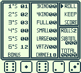

# YatzyGB
YatzyGB is a Gameboy implementation of the dice game Yatzy written in 8bit assembly.

 

---

## Download
[Download on itch.io](https://joelmoore24.itch.io/yatzygb)

## How to play
Yatzy is a game played with five dice. The player gets three rolls and can choose to keep certain dice between each roll. The player must enter a score in one of the categories even if it's a zero.

For a detailed description of the rules check out [Game Rules](https://gamerules.com/rules/yahtzee-dice-game/ 'Full Game Rules')

---

## Playing the game

The game should work when loaded with most emulators.

The game has been tested on.
* VisualBoy
* Emulicious
* Gameboy
* Gameboy Pocket
* Gameboy Color

The game is controlled using:
* **A** for selection
* **B** for back
* **DPAD** for navigation
* **START** for restarting the game

---

## Features I'd like to implement
* Saving the current game
* Highscores, such as being able to enter a high score and view high scores.

---

## Contact
Joel Buchheim-Moore => joelbm24@gmail.com
